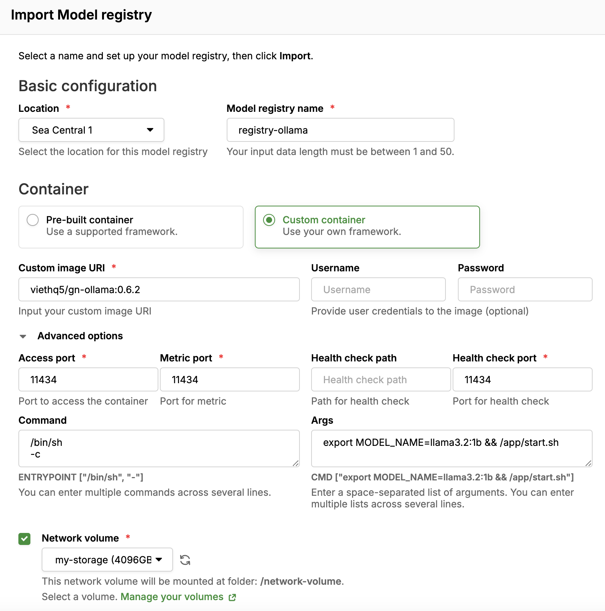

# How to use Ollama in GreenNode AI Platform 
Set up a Model Registry with the docker container URI: ``viethq5/gn-ollama:0.6.2``
Set ``MODEL_NAME`` enviroment to a model from [Ollama Library](https://ollama.com/library) to automatically download a model into configured network volume

For examples:

  

